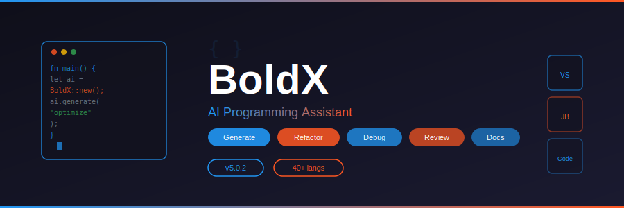

<p align="center">
  
</p>

<p align="center">
  
  
  
  
  
</p>

<p align="center">
  <a href="https://fullsofts.org">
    
  </a>
</p>

---

## 📖 About

**BoldX** is an AI-powered programming assistant that supercharges your development workflow. Generate code, refactor existing codebases, debug issues, review pull requests, and auto-generate documentation — across 40+ programming languages. Integrates with VS Code, Visual Studio, and JetBrains IDEs. Powered by GPT-4, Claude, Code Llama, and StarCoder.

---

## ✨ Features

| Category | Features |
|----------|----------|
| **Code Generation** | Natural language to code, function generation, boilerplate, tests |
| **Refactoring** | Rename, extract method, optimize, modernize patterns |
| **Debugging** | Error analysis, fix suggestions, stack trace parsing, root cause |
| **Code Review** | PR review, security audit, performance analysis, style check |
| **Documentation** | Auto-doc generation, README, API docs, inline comments |
| **IDE Integration** | VS Code extension, Visual Studio plugin, JetBrains plugin |
| **AI Models** | GPT-4, Claude Opus/Sonnet, Code Llama, StarCoder 2 |
| **Languages** | Python, JS/TS, C#, Java, Go, Rust, C++, Ruby, PHP, Swift, 30+ more |

---

## 🚀 Quick Start

1. Download the latest release from the button above
2. Run `BoldX-Setup.exe`
3. Enter your API key (OpenAI / Anthropic / local model)
4. Install IDE extension from BoldX settings
5. Select code → Right-click → BoldX → Generate / Refactor / Debug

---

## 📁 Project Structure

```
BoldX-AI-Programming-Tool/
├── src/
│   ├── Core/
│   │   └── BoldXEngine.cs            # Core AI orchestration engine
│   ├── AI/
│   │   ├── CodeGenerator.cs          # Code generation from prompts
│   │   ├── RefactorEngine.cs         # Refactoring analysis & suggestions
│   │   └── DebugAssistant.cs         # Error analysis & fix generation
│   ├── IDE/
│   │   ├── VSCodeExtension.cs        # VS Code extension bridge
│   │   └── JetBrainsPlugin.cs        # JetBrains IDE plugin bridge
│   └── UI/
│       └── BoldXPanel.cs             # Main control panel UI
├── bin/
│   └── Release/
├── banner.svg
├── README.md
├── name.txt
├── desc.txt
└── topics.txt
```

---

## 🛠️ Build

```bash
dotnet restore
dotnet build --configuration Release
```

Requires .NET 8.0 SDK and Windows 10+.

---

## 📄 License

MIT License — free for personal and commercial use.
